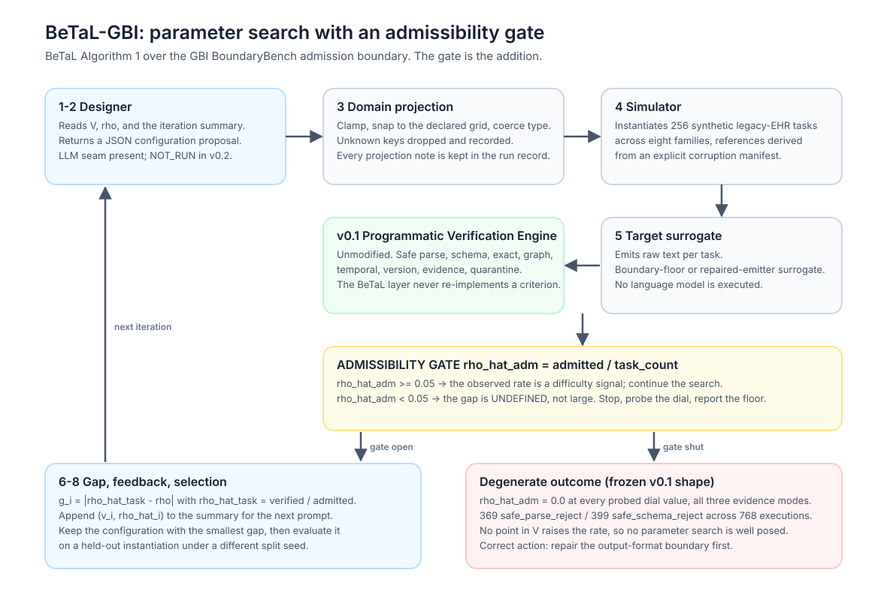
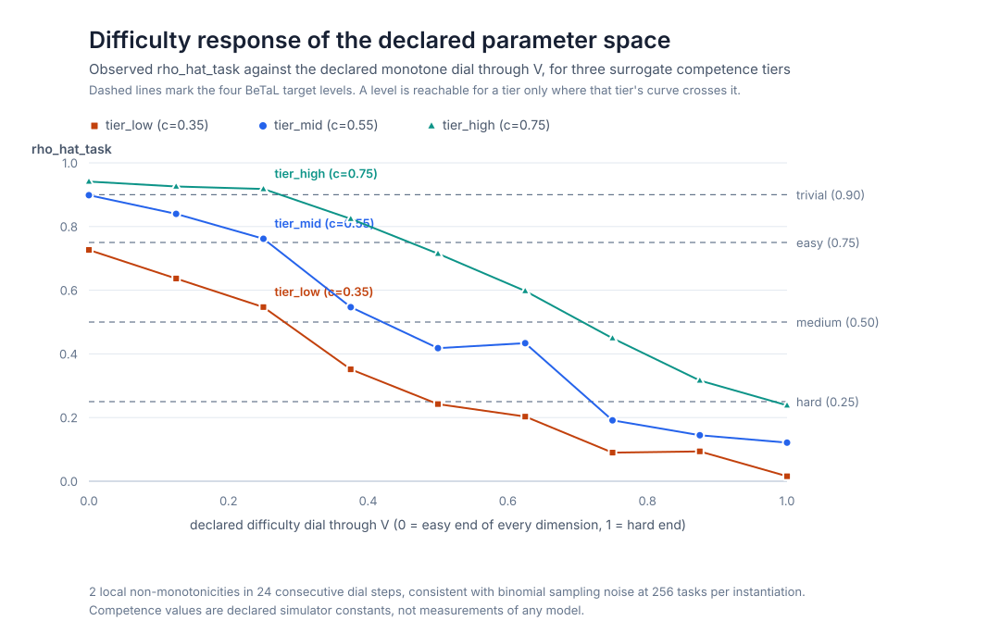

# Technical Specification: Applying BeTaL to GBI-DCSE

**Autonomous benchmark design over the GBI BoundaryBench admission boundary**

| Field | Value |
|---|---|
| Specification version | `betal-gbi-spec-v0.2` |
| Benchmark contract | `benchmark-contract-v0.1` (unmodified) |
| Parameter space | `betal-gbi-parameter-space-v0.2` |
| Simulator | `betal-gbi-simulator-v0.2` |
| Search loop | `betal-gbi-loop-v0.2` |
| Target surrogates | `betal-gbi-target-surrogates-v0.2` |
| Companion results | [`BETAL_V0_2_SEARCH_REPORT.md`](BETAL_V0_2_SEARCH_REPORT.md) |
| Language models executed | **0** |

> **Scope.** This is an evaluation-design specification. It is not a clinical
> decision system, not a medical device, and not an authorization for autonomous
> EHR write-back. All records described here are synthetic and non-clinical.

---

## 1. Objective and the one structural problem

BeTaL ([arXiv:2510.25039](https://arxiv.org/html/2510.25039v1)) treats benchmark
design as optimization over a declared parameter space. A designer LLM proposes a
configuration, a simulator instantiates an environment, a target model is
evaluated, and the loop minimizes the **performance gap**

```
g_hat  =  | rho_hat  -  rho |
```

between the observed rate `rho_hat` and a target rate `rho`, iterating on natural
language feedback about previous rounds.

GBI BoundaryBench supplies exactly what BeTaL needs on the judgment side: a frozen
boundary algebra, a typed action set, and a deterministic verifier that decides
admissibility without a model in the loop. What it does not yet supply is a
*parameterized* environment. This specification adds one.

There is one structural problem to solve before any of that matters.

### 1.1 The frozen v0.1 baseline makes the BeTaL objective ill-posed

The frozen result is:

| Frozen v0.1 quantity | Value |
|---|---:|
| Canonical executions | 768 |
| Completed executions | 768 |
| Accepted `boundarybench.result.v1` records | 0 |
| `safe_parse_reject` | 369 |
| `safe_schema_reject` | 399 |
| Coverage | 0.0 |
| Invalid-output rate | 1.0 |

Every failure occurred at the parse or schema gate — *upstream of task
difficulty*. Substituting into the BeTaL objective:

```
rho_hat(v) = 0   for every v in V
g_hat(v)   = | 0 - rho |  =  rho    for every v in V
```

The gap is **constant over the entire parameter space**. Its gradient is
identically zero. A designer LLM given this feedback signal receives no
information from any proposal, and any configuration it happens to return at
termination is selected by tie-breaking, not by search. Running BeTaL here without
noticing would produce a "tuned" benchmark whose tuning did nothing.

This is not a small-sample artifact. §5 of the companion report demonstrates it
mechanically: across five probe points spanning the parameter space and all three
evidence modes, the admissibility rate takes exactly **one** distinct value, `0.0`.

### 1.2 Resolution: decompose the rate, gate the search

A single scalar rate conflates two failures that require opposite responses. The
specification splits it:

```
rho_hat_adm   =  admitted / task_count
                 emissions that cleared safe parsing and schema validation and so
                 entered the judgment substrate at all

rho_hat_task  =  verified_completion / admitted
                 admitted emissions that satisfied every deterministic criterion

rho_hat       =  rho_hat_task,   defined only when admitted > 0
```

BeTaL tunes `rho_hat_task`. `rho_hat_adm` is **not a difficulty dial** — it is a
prerequisite. The loop therefore carries an **admissibility gate**:

| Condition | Loop behavior |
|---|---|
| `rho_hat_adm >= 0.05` | The observed rate is a difficulty signal. Continue Algorithm 1. |
| `rho_hat_adm < 0.05` | The gap is **undefined**, not large. Halt, sweep the parameter space to prove invariance, emit status `degenerate_gap_admissibility_floor`, select nothing. |

Reporting `g_hat = rho` in the second regime would be a measurement error: it
credits parameter search for a number no parameter can move. Reporting the gap as
*undefined* names the actual finding, which is that the output-format boundary
must be repaired first.

The gate is the substantive addition this specification makes to BeTaL. It also
happens to be what the repository's own "next experiments" section already asked
for: *diagnose parse/schema failures ... test structured-output interfaces.*



---

## 2. Errata against the initial draft specification

The draft that motivated this work contained twelve items that would have
propagated into published artifacts. They are listed here because a benchmark
specification is a governance document: silently fixing an error in it is worse
than recording the fix.

### E1 — The difficulty ladder was inverted

The draft defined `rho` as a **target failure rate** (`HARD: rho = 0.75`,
`MEDIUM: 0.50`, `EASY: 0.25`). BeTaL defines `rho` as a target **performance**
level: hard `0.25`, medium `0.50`, easy `0.75`, trivial `0.90`.

The two conventions agree at medium and are mirror images everywhere else, so a
`g_hat` computed under the failure-rate reading is **not comparable** to any
published BeTaL number. This specification adopts the BeTaL performance
convention throughout. A `failure_rate_view(rho) = 1 - rho` helper is provided and
every artifact carries both fields, but only the performance convention is used
in arithmetic.

The draft also omitted BeTaL's fourth level, `trivial = 0.90`. It is included
here, and it turns out to be the most informative level (§7.4).

### E2 — The task output format would have guaranteed schema rejection

The draft required task instances to be emitted as a **JSON-LD logit receipt**:

```json
{ "@context": "https://gbi-boundarybench.org/v1", "L": [...], "p": [...], "tau": ..., "k": ..., ... }
```

The benchmark's frozen result contract is `boundarybench.result.v1`, which is
`additionalProperties: false` over exactly `{schema_version, task_id, action,
answer, evidence_refs, confidence}`. A payload carrying `@context`, `L`, `p`,
`tau`, `k`, `metadata`, `rho`, `subject`, `interval`, `facility` fails
`validate_result` on *ten* unexpected keys plus a missing `schema_version`.

Instructing a target to emit that envelope as its answer would reproduce the v0.1
`safe_schema_reject` population **by construction** — and would then invite the
conclusion that the model had failed, when the contract had.

The manuscript's own layering resolves this. The logit receipt
`R = (C, L, p, tau, k, m, rho)` of Definition 2.3 is the *evidence envelope*
carried **alongside** a proposal; the admissible transaction is a separate object.
This specification keeps them separate: the task result is
`boundarybench.result.v1`, and evidence-mode metadata travels in the adapter's
existing `category_evidence` / `token_top_k_evidence` channels.

### E3 — The wrong categorical interface

The draft's `category_set` was the mapping boundary algebra
`{exact, equivalent, narrower, broader, conflict, unmapped}`. BoundaryBench's
action set is
`{admit, admit_historical_only, quarantine_slice, abstain, expert_review, reject}`.

Both are legitimate finite boundaries in the manuscript, but they are boundaries
over different decisions. A designer told to tune difficulty over the mapping
algebra would be tuning a decision the verifier never scores.

### E4 — The objective maximized an unvalidated quantity

The draft instructed the designer to *"optimize for Trace Cell Energy (E_sigma)"*
and *"maximize E_sigma on the terminology stalk."*

The manuscript is explicit that its executable appendix computes a
*projector-based obstruction surrogate*, that this "must not be identified with
the cone differential," and that "this numerical table is not evidence that a
deployed mapping-cone diagnostic has been validated." The repository enforces the
same position in code: `verification/diagnostics.py` returns
`DIAGNOSTIC_ONLY_NOT_VALIDATED` with `scoring_weight: 0`.

An optimizer pointed at that quantity would be maximizing a number the project
has declared unvalidated. Under this specification the objective is the gap on
`rho_hat_task`, which the frozen verifier measures. `E_sigma` is retained as a
**zero-weight covariate** (§6).

### E5 — `369/768` is not a failure rate

The draft described *"the 48% failure rate (369/768) observed in safe parsing."*
`369/768 = 48.05%` is the **share of the parse-reject class among all
executions**. The failure rate was `768/768 = 100%`. Understating it by half
inverts the finding.

### E6 — Hypothesized numbers attached to named commercial models

The draft's cross-model table listed *Gemini 2.5 Flash* and *Claude 3.7 Sonnet*
with `[Hypothesized Increase]` and `Admitted (High Coverage)` in the results
columns. Publishing hypothesized performance beside named models in a results
table is a reporting hazard regardless of the bracket notation.

Replaced with declared surrogate competence tiers (`tier_low`, `tier_mid`,
`tier_high`) that are ordered labels for a simulator constant, plus an explicit
`llm_designer_executed: false` and `language_models_executed: 0` in the artifacts.

### E7 — The "Deterministic Verifier Checksum" is the hash of nothing

The draft recorded:

```
Deterministic Verifier Checksum: SHA256: e3b0c44298fc1c149afbf4c8996fb92427ae41e4649b934ca495991b7852b855
```

That is the SHA-256 of the **empty input**. It is asserted as a governance
identifier and reads as a real checksum. Verified programmatically as check 15 of
the verification script.

### E8 — Contract version mismatch

The draft bound artifacts to `Benchmark-contract-v1.1`. The repository's frozen
contract is `benchmark-contract-v0.1`, and `PROVENANCE.json` pins its commit.
Introducing a `v1.1` label would silently orphan the provenance chain.

### E9 — BeTaL role confusion in the cross-model table

The draft's table mixed BeTaL's three distinct roles. In the paper: designers were
GPT-5 / Claude Opus 4.1 / Grok 4; the target model **during parameter search** was
o4-mini; the **evaluation** models were o4-mini, Gemini 2.5 Flash, and Claude 3.7
Sonnet. The draft placed Qwen in the designer's target slot and frontier models in
an "Evaluation Model" column with designer-style gap figures. §7.5 separates the
three roles explicitly.

### E10 — Overstated designer justification

The draft justified Claude Opus 4.1 by its *"superior performance in real-world
agentic benchmarks such as tau-bench."* BeTaL's Table 1 shows Opus 4.1 was best on
the tau-bench airline eval slice (7.7%) but **not** uniformly best: on arithmetic
sequences Grok 4 (8.28%) and GPT-5 (9.0%) beat it (11.78%), and on spatial
reasoning Grok 4 (4.98%) and GPT-5 (5.34%) beat it (7.35%). The defensible claim
is specific to the interactive/agentic slice, which is the slice that resembles
this task.

### E11 — Missing designer sampling temperature

The draft specified a 4096-token reasoning budget but omitted BeTaL's designer
temperature of **0.5**. Both are recorded in `designer_contract.json`.

### E12 — An out-of-domain parameter range

The draft's `evidence_sufficiency` ranged over *"1 to 10 withheld facts."* The
repository's `evidence_sufficiency` family has a finite required-fact list;
withholding 10 is not expressible. The dimension is retained as an integer budget
`0..10` that maps monotonically onto at most five actually-withheld facts, and the
mapping is declared in the simulator rather than left implicit.

---

## 3. The designer environment

### 3.1 Role

BeTaL's designer reads an under-specified environment description, the parameter
set, the target rate, and a natural-language summary of previous iterations, and
returns a configuration. The designer never sees a task's reference answer and
never solves a task.

Intended designer configuration, matching the BeTaL paper:

| Setting | Value |
|---|---|
| Candidate designers | GPT-5, Claude Opus 4.1, Grok 4 |
| Temperature | 0.5 |
| Reasoning budget | 4096 tokens |
| Iterations | 10 |
| Status in v0.2 artifacts | **`NOT_RUN`** |

The `LLMDesigner` class is a thin adapter: supply any callable mapping
`(system, user, temperature, reasoning_budget_tokens) -> str` and the harness
handles JSON extraction, domain projection, transcript recording, and replay via
`TranscriptDesigner`. **No designer LLM was executed for the v0.2 artifacts**, and
the reported numbers come from model-free reference designers (§4.3).

### 3.2 Designer system prompt

Recorded verbatim, with its SHA-256, in
[`designer_contract.json`](../../artifacts/public_results/v0_2/designer_contract.json).

```text
ROLE

You are the Benchmark Tuner for GBI BoundaryBench. You parameterize synthetic
legacy-EHR transformation tasks so that a named target model reaches a specified
verified-completion rate. You are designing an evaluation environment, not
solving its tasks and not making clinical judgments. All records are synthetic
and non-clinical.

WHAT YOU CONTROL

You control exactly the parameters listed in PARAMETER_SPACE. Nothing else. You
may not change the boundary algebra, the action set, the reference rules, the
verifier, or the admissibility policy. Those are frozen by contract; a benchmark
whose verifier moves between iterations measures nothing.

THE QUANTITY YOU ARE TUNING

Observed performance is reported to you as two separate rates.

  rho_hat_adm  = admitted / task_count
                 the fraction of target emissions that cleared safe parsing and
                 schema validation and therefore entered the judgment substrate.

  rho_hat_task = verified_completion / admitted
                 the fraction of ADMITTED emissions that satisfied every
                 deterministic criterion.

You are tuning rho_hat_task toward the target rate rho. rho is a target
PERFORMANCE rate, so a LOWER rho means a HARDER benchmark.

You are NOT tuning rho_hat_adm. If rho_hat_adm is at or near zero, the target is
failing at the output-format boundary, upstream of anything your parameters
control. Do not attempt to compensate by changing difficulty; report that the
admissibility floor must be repaired first and stop. Difficulty parameters
cannot move a rate that is pinned by malformed output.

DECLARED MONOTONICITY

Every parameter has a declared harder_direction. Moving a parameter in that
direction is intended to lower rho_hat_task and never to raise it. If an
observation contradicts this, say so explicitly in your rationale rather than
silently working around it: a broken monotonicity claim is a finding about the
parameter space, not noise to be smoothed over.

HOW TO USE THE HISTORY

ITERATION_HISTORY gives you, for each previous iteration, the configuration, the
two observed rates, the resulting gap |rho_hat_task - rho|, and per-family
rates. Use it to bracket. Once you have one configuration above rho and one
below it, interpolate between them rather than restarting your search. Use the
per-family rates to find which single parameter is carrying the deviation
instead of moving everything at once.

OUTPUT FORMAT

Return exactly one JSON object and no other text:

{
  "parameters": { "<parameter_name>": <number>, ... },
  "rationale": "<two or three sentences: what you changed, and what you expect>",
  "expected_rho_hat_task": <number between 0 and 1>,
  "admissibility_blocked": <true or false>
}

Include every parameter name from PARAMETER_SPACE. Values outside a declared
domain are projected onto it and the projection is recorded against you, so
propose in-domain values. Set "admissibility_blocked" to true if and only if you
are stopping because rho_hat_adm is pinned near zero.
```

Three design choices in that prompt are load-bearing:

1. **The designer is told what it may not change.** A designer that could adjust
   the verifier or the reference rules could hit any target rate trivially and
   measure nothing.
2. **The two rates are reported separately, with the gate explained.** The
   designer is instructed to *stop and report* rather than compensate. Without
   this, a capable designer confronted with `rho_hat_adm = 0` would rationally
   try to lower difficulty forever.
3. **Monotonicity violations are requested as findings, not smoothed over.** A
   space whose declared `harder_direction` does not hold is defective, and the
   defect should surface rather than be absorbed by the optimizer.

### 3.3 Response handling

Designer output passes through `ProjectToDomain` before use. Projection is
**total**: it never raises, never fails a run, and records everything it did.

| Situation | Action | Recorded note |
|---|---|---|
| Value below/above bound | Clamp | `<name>:clamped_low` / `:clamped_high` |
| Value off the declared grid | Snap to nearest step | `<name>:snapped_to_step` |
| Non-numeric but coercible | Coerce | `<name>:coerced_to_number` |
| NaN / infinity | Replace with easy end | `<name>:non_finite_replaced_with_low` |
| Unknown key | Drop | `<name>:unknown_parameter_dropped` |
| Missing key | Default to **easy** end | `<name>:missing_defaulted_to_easy_end` |

Missing keys default to the *easy* end deliberately. A designer that fails to name
a dimension should not silently receive a harder benchmark; the conservative
default plus the recorded note makes the omission visible.

---

## 4. Parameter space, simulator, algorithm

### 4.1 The parameter space V

Nine dimensions, all continuous ones snapped to a declared step grid, so `V` is
finite: **2,218,750,380** grid points.

| Parameter | Domain | Step | Grid pts | Family | Harder |
|---|---|---|---:|---|---|
| `patient_identity_normalization` | [0.0, 1.0] | 0.05 | 21 | `patient_identity_normalization` | up |
| `orphan_rate` | [0.0, 0.5] | 0.05 | 11 | `orphan_duplicate_detection` | up |
| `field_anomaly_bleed` | [0.0, 0.5] | 0.05 | 11 | `field_anomaly_bleed` | up |
| `code_system_version_validation` | [0.0, 1.0] | 0.05 | 21 | `code_system_version_validation` | up |
| `mapping_arity` | {1..6} | 1 | 6 | `rpms_to_fhir_mapping` | up |
| `temporal_ambiguity` | [0.0, 1.0] | 0.05 | 21 | `temporal_status_classification` | up |
| `evidence_sufficiency` | {0..10} | 1 | 11 | `evidence_sufficiency` | up |
| `policy_conflict_depth` | {0..4} | 1 | 5 | `policy_action_selection` | up |
| `distractor_actions` | {0..5} | 1 | 6 | *(all families)* | up |

Eight dimensions map one-to-one onto the eight v0.1 task families. The ninth,
`distractor_actions`, widens `allowed_actions` uniformly and always retains the
reference action.

A **declared difficulty map** turns a configuration into a per-family latent
difficulty in `[0,1]`, plus a deterministic per-task jitter of ±0.12 so the
observed rate is a smooth function of `v` rather than an eight-step staircase. The
map is a simulator property, published in `parameter_space.json`. It is not a
clinical severity model and is not fitted to any model's behavior.

### 4.2 Simulator and reference derivation

`InstantiateSimulator(v)` emits `boundarybench.task.v1` instances, balanced
round-robin across the eight families, plus a sidecar corruption manifest
recording which corruption was applied and which reference action it entails.

Two properties are enforced and verified:

- **Determinism.** Task content is a pure function of
  `(space_version, config_digest, split_seed, family, index)`. Re-instantiation is
  byte-identical, so a configuration is a citable object. A different `split_seed`
  yields a genuinely different instantiation, which is what makes the held-out
  evaluation in §4.4 meaningful.
- **Manifest-derived references.** Reference actions come from the corruption
  manifest, never from a model and never from a human label.

#### A compatibility constraint worth recording

The v0.1 graders are **coupled to specific `input` key shapes** for three
families, and a generator that ignores this produces tasks that no correct answer
can pass:

| Family | Keys the v0.1 verifier requires |
|---|---|
| `temporal_status_classification` | `input.status` authoritative; `answer.temporal_status ∈ {active, historical}`; `ACTIVE ⇒ admit`, else `admit_historical_only` |
| `code_system_version_validation` | `input.code`, `input.code_version`; `answer.code_system`, `answer.code`; `"10" ⇒ admit`, `"9" ⇒ admit_historical_only`, else `reject` |
| `rpms_to_fhir_mapping` | `input.table`, `input.row`; `answer.resource_type`, `answer.source_record_id`, `answer.rpms_row_id` |

The first draft of the generator used its own key names and its own richer
reference semantics for these families (for example an `expert_review` outcome for
an open validity interval). Every such task would have failed
`temporal_criterion`, `version_criterion`, or `graph_criterion` regardless of the
answer — the benchmark would have reported a difficulty result that was actually a
contract mismatch.

The consequence is a real design constraint: for the coupled families, **difficulty
must be injected through the evidence surface, not through the reference rule.**
The temporal family scales difficulty by adding *conflicting* date and narrative
cues that contradict the authoritative `status` field, while the reference rule
stays exactly as v0.1 defines it. This is the stronger design anyway — it keeps
difficulty scaling separable from reference-label drift.

Verified: an oracle emitting the manifest-derived reference reaches
`rho_hat_task = 1.0` on all eight families at five points across `V`.

### 4.3 BeTaL-GBI Algorithm 1

```
Input:  parameter space V, target rate rho, target M_t, designer M_d,
        iterations I, task count N, split seeds (search, holdout)
Init:   history <- [] ; best <- none ; best_gap <- infinity

for i = 1 .. I:
    1-2. v_i        <- M_d( environment, V, rho, summary(history) )
    3.   v_i        <- ProjectToDomain(v_i, V)                 # total; notes recorded
    4.   D_i        <- InstantiateSimulator(v_i, N, search_seed)
    5.   e_i        <- Evaluate(M_t, D_i)                      # v0.1 PVE, unmodified

         # --- admissibility gate ---
         if e_i.rho_hat_adm < 0.05:
             probe V along the declared dial
             return status = degenerate_gap_admissibility_floor, selection = none

    6.   g_i        <- | e_i.rho_hat_task - rho |
    7.   history    <- history + (v_i, e_i)
    8.   if g_i < best_gap: best, best_gap <- v_i, g_i

# held-out evaluation under a different split seed
D*      <- InstantiateSimulator(best, N, holdout_seed)
return  best, best_gap, | Evaluate(M_t, D*).rho_hat_task - rho |
```

All grading in step 5 is delegated to the **unmodified** v0.1 Programmatic
Verification Engine. The BeTaL layer generates tasks and evaluates targets; it
never re-implements a criterion. `PROVENANCE.json` records
`verifier.modified_for_v0_2: false`.

### 4.4 Search strategies

| Strategy | Role | Behavior |
|---|---|---|
`feedback_coordinate` | Reference feedback designer | Phase 1 brackets the declared monotone dial (secant once a bracket exists, extrapolation before). Phase 2 holds the best dial and nudges the two coordinates whose per-family rate deviates most, one grid step at a time. |
`random_sampling_ppr` | BeTaL RS+PPR baseline | Uniform grid sampling with 50% prioritized replay around the best-so-far configuration. |
`best_of_n` | BeTaL BoN baseline | Independent samples, history ignored. |

These are **model-free**. They exist so the harness has a reproducible, auditable
control, and so the reported numbers depend on no provider. They are not stand-ins
for a frontier designer's reasoning, and no result from them may be reported as an
LLM designer result.

The `holdout_seed` evaluation is the analogue of BeTaL's "Eval" column: the
selected configuration is re-instantiated with different synthetic content, which
separates *the configuration generalizes* from *the search overfitted one draw*.

---

## 5. Target surrogates

| Surrogate | Purpose | Behavior |
|---|---|---|
`v01_boundary_floor_surrogate` | Demonstrate the degenerate gap | Every execution completes; every emission fails at parse or schema in the frozen 123:133 per-mode proportion. `rho_hat_adm ≡ 0`. |
`repaired_emitter_c<NNN>` | Provide a non-degenerate response surface | Always schema-valid. Correct with probability `sigma(k(competence - difficulty))`; otherwise schema-valid but wrong, drawn from `wrong_action`, `missing_required_evidence`, `wrong_answer`. |
`reference_oracle` | Solvability instrument | Emits the manifest-derived reference always. |

"Competence" is a **declared simulator constant**. It is not a measurement of any
language model and must not be reported as one. The boundary-floor surrogate
reproduces the *shape* of one frozen run; it is not Qwen3-4B-Instruct-2507 and no
result from it may be attributed to that or any other model.

The oracle deserves a note on why it exists separately. `RepairedEmitterTarget` at
`competence = 1.0` cannot serve as a solvability check: its solve probability
tends to `0.5` as declared difficulty tends to `1.0` for any sharpness constant,
so a shortfall at the hard end measures the response function rather than the task
set. Using it as the oracle initially masked exactly the class of bug it was meant
to catch — an unsolvable-by-construction task at the hard end of the dial.

---

## 6. The mapping-cone diagnostic

The manuscript defines trace cell energy (Definition 7.1) as

```
E_sigma  =  tr( Pi_Lambda  Pi_sigma )
```

with `Pi_Lambda` the projector onto the obstruction null space of a cone Laplacian
and `Pi_sigma` a stalk projector, and gates surgical quarantine on
`E_sigma > theta` (§7.3). It is candid that its appendix computes a
*projector-based obstruction surrogate*, not a cone differential.

This specification closes that gap for the BeTaL environment. `betal/cone.py`
builds a genuine sheaf morphism `phi : F -> G` on a finite cell complex, assembles
the actual cone differential

```
d_cone(x, y)  =  ( -delta_F x ,  phi(x) + delta_G y )
```

forms the degree-0 cone Hodge Laplacian
`Delta = d^{-1}(d^{-1})* + (d^0)* d^0`, and reads `Pi_Lambda` off its kernel.

### 6.1 Why the restriction map cannot be the identity

The first attempt used identity restriction maps and encoded axis agreement by
zeroing a vertex component of `phi`. That construction is **not a mapping cone**:
`d_cone` did not square to zero, because `phi` was not a chain map. The chain-map
condition is

```
phi_e . F_{v->e}  =  G_{v->e} . phi_v
```

and with identity restrictions on a connected complex it forces every `phi` to be
the same map — so no per-axis morphism exists and no obstruction can be localized.
The symptom was a diagnostic that reported zero obstruction unless *all* axes
disagreed.

The fix is structural rather than cosmetic: the restriction map is
`diag(1, 0)`, which is rank-deficient by design. The second stalk coordinate is
then unconstrained by the chain-map condition, which is exactly the degree of
freedom a per-axis grounding morphism needs. Setting `phi_v = diag(1, b_v)` with
`b_v` the agreement indicator gives a valid chain map. `cone.py` now **asserts**
`d^0 . d^{-1} = 0` at every call rather than assuming it.

With that correction the diagnostic behaves as the manuscript's localization claim
predicts, exactly and for all eight agreement patterns:

| Disagreeing axes | dim H⁰(Cone φ) | E_identity | E_terminology | E_provenance_temporal |
|---|---:|---:|---:|---:|
| *(none)* | 0 | 0.0 | 0.0 | 0.0 |
| identity | 1 | **1.0** | 0.0 | 0.0 |
| terminology | 1 | 0.0 | **1.0** | 0.0 |
| provenance/temporal | 1 | 0.0 | 0.0 | **1.0** |
| identity + terminology | 2 | **1.0** | **1.0** | 0.0 |
| identity + prov/temporal | 2 | **1.0** | 0.0 | **1.0** |
| terminology + prov/temporal | 2 | 0.0 | **1.0** | **1.0** |
| all three | 3 | **1.0** | **1.0** | **1.0** |

Stalk energies sum to the obstruction dimension, and `E_sigma` is nonzero exactly
on the disagreeing axes.

### 6.2 What this does and does not license

It licenses one sentence: *on this declared toy complex, the trace cell energy
computed from a genuine cone Laplacian localizes obstruction to the disagreeing
stalk, and the localization is basis-invariant.*

It does not license clinical use. The complex is a declared three-axis triangle
with two-dimensional stalks; the axis mapping is coarse; nothing has been validated
against clinical outcomes. Consistent with `verification/diagnostics.py`, every
value carries `status: DIAGNOSTIC_ONLY_NOT_VALIDATED`, `scoring_weight: 0`,
`validated: false`, and **none of it enters the BeTaL objective**.

---

## 7. Evaluation protocol

### 7.1 Metric set per instantiation

`rho_hat_adm`, `rho_hat_task`, coverage, selective risk, false acceptance, false
rejection, abstention, quarantine count, invalid-output rate, verifier status
distribution, and per-family slices. Coverage and selective risk follow v0.1
semantics exactly (`coverage = parsed and action != abstain`), so v0.2 numbers sit
beside v0.1 numbers without redefinition.

### 7.2 Reachability must be reported before gaps

A target level is reachable for a target only if some configuration in `V`
produces that rate. When it is not, `g_hat` has a nonzero floor that is a property
of the *space*, not of the search — and a search reported without it looks like it
underperformed when it in fact saturated.

`monotonicity_and_reachability.json` records, per (target, level), the observed
range, a reachability flag, and the attainable gap floor.

### 7.3 Declared monotonicity is checked, not assumed

Nine points along the dial, per target tier. Local violations are expected from
binomial sampling noise at `N = 256`; the reported quantity is the count of strict
violations and the usable dynamic range.



### 7.4 Transfer

BeTaL's transferability claim is that a benchmark tuned against one target still
separates other targets in a consistent order. The protocol evaluates the selected
configuration against all three declared tiers on a shared instantiation and
checks whether the separation order is preserved. The measured property is
*ordering*, and it is a property of the surrogate family — not evidence about any
named commercial model.

### 7.5 The three roles must stay separate

| Role | This specification | BeTaL paper |
|---|---|---|
| **Designer** | `LLMDesigner` seam, `NOT_RUN`; model-free reference designers used | GPT-5, Claude Opus 4.1, Grok 4 |
| **Target during search** | `repaired_emitter_c055` (declared surrogate) | o4-mini |
| **Evaluation targets** | `tier_low`, `tier_mid`, `tier_high` (declared surrogates) | o4-mini, Gemini 2.5 Flash, Claude 3.7 Sonnet |

Collapsing these three columns is E9. A table that reports a designer's gap
against a model in the target column, and frontier models in the evaluation
column, cannot be read.

---

## 8. Governance and reproducibility

| Identifier | Value |
|---|---|
| Benchmark contract | `benchmark-contract-v0.1` (unmodified) |
| Run plan | `betal-search-plan-v0.2.0` |
| Verifier | v0.1 PVE, `modified_for_v0_2: false` |
| Language models executed | 0 |
| Provider calls | 0 |
| Held-out references read | 0 |
| Confidence intervals | `NOT_RUN` |
| Repeat-run stability | `NOT_RUN` |
| Provider cost | `NOT_RUN` |
| Calibration source | `artifacts/public_results/v0_1/status_distributions.json` |

```bash
# regenerate every artifact
PYTHONPATH=src python3 scripts/run_betal_v0_2_search.py

# independently re-derive every reported number (260 checks)
PYTHONPATH=src python3 scripts/verify_betal_v0_2_artifacts.py

# regenerate figures from the artifacts
python3 docs/betal/figure_sources/make_betal_figures.py
```

Every artifact is covered by `SHA256SUMS`, and the verification script checks that
the manifest matches what is on disk.

`NOT_RUN` is used rather than an omission or a plausible-looking placeholder,
following the v0.1 convention. E7 is what happens when a placeholder is dressed as
a value.

---

## 9. Limitations

1. **No language model was executed.** Everything reported is the behavior of a
   declared simulator against declared surrogates. The v0.2 artifacts measure the
   *harness*, not any model.
2. **The reference designer stalls.** In the hard-level run, iterations 7–10
   produced identical proposals (§6 of the report). Roughly 3–4 of 10 iterations
   are wasted. This is a limitation of the model-free control, and it is part of
   why BeTaL uses an LLM designer.
3. **The dial is a path, not the space.** Phase 1 searches one monotone curve
   through a space of ~2.2 × 10⁹ grid points. Phase 2 leaves the curve, which is
   why some selected configurations beat the dial-derived attainable floor — but
   the vast majority of `V` is unexplored.
4. **The declared difficulty map is a modeling choice.** Different base/slope
   constants would give different reachable ranges. It is published so it can be
   disagreed with.
5. **Difficulty saturates at the hard end.** Family difficulty clips at 1.0, so the
   hard end of the dial compresses; this bounds how low `rho_hat_task` can be
   driven for a high-competence target.
6. **No confidence intervals, no repeat-run stability.** Single-run point
   estimates at `N = 256`; binomial noise is roughly ±3 percentage points.
7. **The cone diagnostic is coarse and unvalidated.** Three axes, a binary
   agreement indicator per axis, zero scoring weight.
8. **Synthetic and non-clinical throughout.** No claim about clinical safety,
   real EHR data, or deployment readiness.

## 10. Next experiments

1. Execute a real designer LLM through the `LLMDesigner` seam at temperature 0.5
   with a 4096-token budget, record the transcript, and compare against the
   model-free controls on the same seeds.
2. Repair the admissibility floor on public-development cases — structured-output
   / constrained decoding, a format-repair stage, a retry budget — and report
   `rho_hat_adm` before and after. Only then is a real target's `rho_hat_task`
   tunable.
3. Once `rho_hat_adm > 0` for a real open-weight model, run the search against it
   and report the gap with confidence intervals and repeat-run stability.
4. Add a second open-weight family, and closed providers under output-only
   constraints, as the repository's v0.1 limitations section already proposes.
5. Replace the dial-plus-coordinate search with a proper grid or Bayesian search
   to quantify how much of `V` the reference designer misses.
