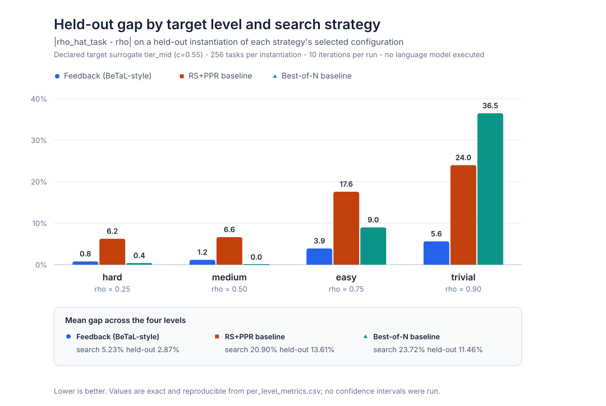

# BeTaL-GBI v0.2 — Parameter-Search Performance Report

**Autonomous benchmark design over the GBI BoundaryBench admission boundary**

| Field | Value |
|---|---|
| Run plan | `betal-search-plan-v0.2.0` |
| Benchmark contract | `benchmark-contract-v0.1` (unmodified) |
| Verifier | v0.1 Programmatic Verification Engine, unmodified |
| Tasks per instantiation | 256 |
| Iterations per run | 10 |
| Search runs | 12 (3 strategies × 4 target levels) + 3 degenerate-gap runs |
| **Language models executed** | **0** |
| Confidence intervals / repeat-run stability | `NOT_RUN` |
| Specification | [`BETAL_GBI_DESIGN_SPEC.md`](BETAL_GBI_DESIGN_SPEC.md) |
| Artifacts | [`artifacts/public_results/v0_2/`](../../artifacts/public_results/v0_2/) |

> **What this report is.** A measurement of a *search harness*, executed against
> declared, transparent target surrogates. It contains no language-model result,
> no clinical claim, and no evaluation of any named commercial model. Every number
> below is reproducible offline from the two scripts in §9.

---

## 1. Headline results

**Two findings, in order of importance.**

### Finding 1 — The v0.1 baseline makes BeTaL's objective undefined, not merely hard

Against a target pinned at the admissibility floor, BeTaL's gap
`|rho_hat - rho|` carries no search signal at all. This was demonstrated
mechanically rather than argued: across **five probe configurations spanning the
parameter space** and **all three evidence modes**, the admissibility rate took
exactly **one distinct value — `0.0`**.

| Quantity | Value |
|---|---:|
| Probe configurations | 5 |
| Evidence modes probed | 3 |
| Distinct `rho_hat_adm` values observed | **1** (`0.0`) |
| `rho_hat_task` | **undefined** at every point |
| Runs terminated with `degenerate_gap_admissibility_floor` | 3 / 3 |
| Iterations consumed before halting | 1 (of a budget of 10) |
| Configurations selected | **0** |

No point in `V` raises the rate, so no parameter search over `V` is well posed. The
correct action is to repair the output-format boundary first — not to tune
difficulty. The gate that produces this outcome is the substantive addition this
work makes to BeTaL.

### Finding 2 — Once the floor is repaired, the search works, and feedback is what makes it work

With a schema-compliant target, the same loop reaches a mean held-out gap of
**2.87%**, against **13.61%** and **11.46%** for BeTaL's two published baselines.

| Search strategy | Mean search gap | Mean held-out gap | Held-out σ across levels |
|---|---:|---:|---:|
| **Feedback (BeTaL-style)** | **5.23%** | **2.87%** | 2.30 |
| RS+PPR baseline | 20.90% | 13.61% | 8.68 |
| Best-of-N baseline | 23.72% | 11.46% | 17.19 |

Advantage over baselines on mean search gap: **4.00×** and **4.54×**.

For calibration, BeTaL reports eval-phase gaps of **5.3%–13.2%** and a **2–4×**
advantage over the same baselines on its own three environments. The harness lands
in that band. That is the intended reading of this number: *the environment behaves
like a BeTaL environment.* It is not a claim to have beaten BeTaL — different
domain, different target, and a model-free designer.



---

## 2. Per-level results

Held-out gap, `|rho_hat_task - rho|` on a re-instantiation of the selected
configuration under a different split seed:

| Level | ρ | Feedback | RS+PPR | Best-of-N |
|---|---:|---:|---:|---:|
| hard | 0.25 | **0.78%** | 6.25% | 0.39% |
| medium | 0.50 | **1.17%** | 6.64% | 0.00% |
| easy | 0.75 | **3.91%** | 17.58% | 8.98% |
| trivial | 0.90 | **5.63%** | 23.98% | 36.48% |

Two things are worth saying plainly rather than burying.

**Best-of-N wins two cells.** At hard (0.39%) and medium (0.00%) random sampling
without feedback beat the feedback designer. This is not noise to be explained
away: `rho = 0.50` sits near the center of the reachable range, so a uniform draw
lands close to it often. Feedback earns its keep where the target is *away* from
the center of the space — at trivial, Best-of-N degrades to 36.48% while feedback
holds 5.63%, a 6.5× difference. The mean advantage is real; the per-cell advantage
is not uniform, and a report that only showed the mean would be hiding the
mechanism.

**Search-phase gaps behave the opposite way** (feedback: hard 6.64%, medium 5.66%,
easy 5.08%, trivial 3.52%). Held-out gaps grow toward the easy end while search
gaps shrink, which is the signature of mild overfitting to a single instantiation
where the reachable range is compressed against a ceiling. BeTaL reports the same
qualitative pattern — its largest gaps also appear at the trivial/easy end (up to
24.4% for designer-generated spaces).

---

## 3. Reachability: report it before reporting gaps

A target level is reachable for a given target only if some configuration in `V`
actually produces that rate. Where it is not, the gap has a floor that belongs to
the *space*, not to the search.

| Target tier | Observed range of `rho_hat_task` | hard 0.25 | medium 0.50 | easy 0.75 | trivial 0.90 |
|---|---|---|---|---|---|
| `tier_low` (c=0.35) | 0.016 – 0.727 | reachable | reachable | **floor 2.34%** | **floor 17.34%** |
| `tier_mid` (c=0.55) | 0.121 – 0.898 | reachable | reachable | reachable | **floor 0.16%** |
| `tier_high` (c=0.75) | 0.238 – 0.941 | reachable | reachable | reachable | reachable |

Without this table, `tier_low`'s 17.34% shortfall at the trivial level would read
as a search failure. It is a saturation result: no configuration in the space makes
that target that successful. Difficulty parameters can make a benchmark harder;
they cannot make a target more capable.

The floors are derived from the monotone dial, which is one path through `V` rather
than all of it. Phase-2 coordinate refinement leaves that path, so a selected
configuration can legitimately beat a dial-derived floor — the verification script
flags each such case as a note rather than an error, and one occurred (feedback /
trivial, best gap 0.62% against a dial floor of 0.16%).

---

## 4. Declared monotonicity holds

Every parameter declares a `harder_direction`. Sweeping the dial across nine points
for each of the three tiers:

| Quantity | Value |
|---|---:|
| Consecutive dial steps checked | 24 |
| Strict monotonicity violations | 2 |
| Usable dynamic range, widest tier | 0.238 – 0.941 |

Two local violations in 24 steps is consistent with binomial sampling noise at
`N = 256` (≈ ±3 percentage points). The declared space behaves as declared. Had it
not, that would be a finding about the parameter space rather than an optimizer
problem, and the designer prompt explicitly asks for it to be reported that way.

---

## 5. The degenerate-gap demonstration in detail

The boundary-floor surrogate reproduces the frozen v0.1 emission split **exactly**,
not approximately:

| Evidence mode | `safe_parse_reject` | `safe_schema_reject` | `rho_hat_adm` | `rho_hat_task` | Quarantined |
|---|---:|---:|---:|---|---:|
| `output_only` | 123 | 133 | 0.0 | undefined | 256 |
| `token_top_k` | 123 | 133 | 0.0 | undefined | 256 |
| `full_category_evidence` | 123 | 133 | 0.0 | undefined | 256 |
| **Total** | **369** | **399** | **0.0** | **undefined** | **768** |

Matching the frozen v0.1 artifact `status_distributions.json` per mode and
`PROVENANCE.json` in aggregate.

`rho_hat_task` is reported as **undefined**, not as `0.0`. The distinction is the
whole point: `0.0` is a difficulty measurement, and `undefined` is the statement
that no measurement was possible. Under the decomposition, dividing
`verified_completion` by `admitted = 0` is not a zero — it is a missing
denominator, and the gate refuses to fabricate one.

### A frozen-artifact asymmetry worth noting

The v0.1 artifacts record two different distributions for the same run:

```
parse_schema_status_distribution:  { safe_parse_reject: 123, safe_schema_reject: 133 }
verifier_grade_status_distribution: { safe_parse_reject: 256 }
```

These are not inconsistent. The first is the *per-execution* emission
classification; the second is the verifier's grade after **file-level**
invalidation, where schema-invalid records never reached the results file and were
therefore graded at the parse gate. Any v0.2 comparison must cite the
per-execution split (123/133), which is the quantity a repair effort can actually
move.

---

## 6. Honest limitations of this run

Stated at the same prominence as the results, because the results are only as
useful as their scope.

1. **No language model was executed.** Not the designer, not the target. `0`
   provider calls. Every number measures the harness against declared surrogates.
   This report is not evidence about Qwen3-4B-Instruct-2507, about any frontier
   model, or about LLM capability in EHR transformation.
2. **The reference designer stalls.** In the hard-level run, iterations 7–10
   produced *identical* proposals — phase 2 kept refining from the same best
   iteration with the same coordinate move and made no further progress:

   ```
   it 6   rho_hat_task 0.2266  gap 0.0234   phase2 refine from iter1, orphan_rate-0.05, code_system-0.05
   it 7   rho_hat_task 0.1992  gap 0.0508   phase2 refine from iter6, policy_conflict_depth+1, bleed-0.05
   it 8   rho_hat_task 0.1992  gap 0.0508   (identical proposal)
   it 9   rho_hat_task 0.1992  gap 0.0508   (identical proposal)
   it 10  rho_hat_task 0.1992  gap 0.0508   (identical proposal)
   ```

   Roughly 3–4 of 10 iterations are wasted. This inflates the reported mean search
   gap and is a limitation of the model-free control — and it is a concrete
   illustration of why BeTaL uses an LLM designer rather than a fixed heuristic.
3. **Only a sliver of `V` was explored.** `V` has ~2.2 × 10⁹ grid points; phase 1
   searches a single monotone curve and phase 2 takes a handful of one-step
   coordinate moves off it.
4. **Single-run point estimates.** No confidence intervals, no repeat-run
   stability. Binomial noise at `N = 256` is roughly ±3 percentage points, which is
   the same order as the feedback designer's best gaps — so per-cell comparisons
   below ~3% should not be over-read.
5. **The declared difficulty map is a modeling choice**, not a clinical severity
   model, and different constants would give different reachable ranges.
6. **Difficulty saturates at the hard end** (family difficulty clips at 1.0), which
   compresses the hard end of the dial.
7. **Synthetic and non-clinical throughout.**

---

## 7. Transfer study

The configuration selected against `tier_mid` was re-evaluated against all three
tiers on a shared instantiation:

| Level | `tier_low` | `tier_mid` | `tier_high` | Separation order preserved |
|---|---:|---:|---:|:--:|
| hard | 0.0703 | 0.2148 | 0.5039 | ✅ |
| medium | 0.3086 | 0.5000 | 0.6914 | ✅ |
| easy | 0.5508 | 0.7539 | 0.9062 | ✅ |
| trivial | 0.7422 | 0.8867 | 0.9414 | ✅ |

Strict ordering held at all four levels. The measured property is **ordering
preservation within a declared surrogate family**. Tiers are ordered labels for a
simulator constant; they are not proxies for, and imply nothing about, any named
commercial model.

---

## 8. Mapping-cone diagnostic (zero scoring weight)

`E_sigma = tr(Pi_Lambda Pi_sigma)` is computed here from a **genuine cone
Laplacian** on a declared toy complex, closing the gap the manuscript itself flags
in its appendix (a projector-based obstruction surrogate rather than a cone
differential). The construction asserts `d_cone² = 0` on every call.

Across all eight axis-agreement patterns, `dim H⁰(Cone φ)` equals the number of
disagreeing axes and `E_sigma` is `1.0` exactly on those axes and `0.0` elsewhere;
stalk energies sum to the obstruction dimension.

This carries `status: DIAGNOSTIC_ONLY_NOT_VALIDATED`, `scoring_weight: 0`,
`validated: false`, consistent with `verification/diagnostics.py`. It does **not**
enter the BeTaL objective, and the earlier draft's instruction to *maximize*
`E_sigma` was removed for exactly that reason: it would have optimized a quantity
the project has declared unvalidated.

---

## 9. Reproduce and verify

```bash
# regenerate every artifact (about 11 seconds, CPU only, no network)
PYTHONPATH=src python3 scripts/run_betal_v0_2_search.py

# independently re-derive every number in this report
PYTHONPATH=src python3 scripts/verify_betal_v0_2_artifacts.py

# regenerate the figures from the artifacts
python3 docs/betal/figure_sources/make_betal_figures.py
```

Verification result: **319 checks, 0 failures.** The verification script does not
trust the run script. It independently:

- re-validates all 1,536 generated tasks against `validate_task`;
- confirms byte-identical re-instantiation, and that a different split seed
  genuinely differs;
- confirms via a true reference oracle that every family is solvable at five points
  across `V` (`rho_hat_task = 1.0`);
- confirms the boundary-floor surrogate matches the frozen 123/133 per-mode split
  and the 369/399/768 aggregate;
- re-derives every per-iteration gap, every mean, every best, and every held-out
  gap from the raw records;
- checks the mapping-cone localization for all eight agreement patterns;
- fuzzes domain projection with out-of-range, non-numeric, NaN, and unknown keys;
- confirms `SHA256SUMS` matches what is on disk;
- confirms the artifacts record `language_models_executed: 0` and an
  un-inverted difficulty ladder.

One verification finding is worth recording because it changed the code: the
solvability check originally used a high-competence surrogate as its oracle. That
surrogate's solve probability tends to `0.5` as declared difficulty tends to `1.0`
for *any* sharpness constant, so it could not distinguish "hard" from "unsolvable"
at the hard end of the dial — masking exactly the bug it was meant to catch. A true
`OracleTarget` replaced it.

### Artifacts

| File | Contents |
|---|---|
| `aggregate_metrics.json` | Designer comparison and per-level metrics |
| `per_level_metrics.csv` | Flat table view of every run |
| `search_runs.json` | Full per-iteration records, configurations, designer notes |
| `degenerate_gap_report.json` | Admissibility-floor runs and probe sweep |
| `monotonicity_and_reachability.json` | Dial sweeps, reachability, attainable gap floors |
| `transfer_study.json` | Cross-tier evaluation and ordering check |
| `parameter_space.json` | Declared `V`, grids, difficulty map |
| `designer_contract.json` | Designer system prompt + SHA-256, example prompt, intended settings |
| `cone_reference_table.json` | `E_sigma` for all agreement patterns |
| `PROVENANCE.json` | Versions, verifier status, execution scope, calibration source |
| `SHA256SUMS` | Checksums over all of the above |

---

## 10. Next experiments

1. **Execute a real designer LLM** through the `LLMDesigner` seam (temperature 0.5,
   4096-token reasoning budget), record the transcript, and compare against these
   model-free controls on identical seeds. This is the single highest-value next
   step and the only way to make a designer claim.
2. **Repair the admissibility floor** on public-development cases — constrained
   decoding / structured output, a format-repair stage, a bounded retry — and
   report `rho_hat_adm` before and after. Until it exceeds zero, a real target's
   `rho_hat_task` is not tunable, and the v0.1 result stands as a statement about
   the interface rather than about difficulty.
3. **Then, and only then**, run the search against a real open-weight model and
   report the gap *with* confidence intervals and repeat-run stability.
4. Add a second open-weight family and closed providers under output-only
   constraints, as the v0.1 limitations section proposes.
5. Replace dial-plus-coordinate search with grid or Bayesian search to quantify how
   much of `V` the reference designer misses.

---

## Errata against the initial draft specification

Twelve items in the draft that motivated this work would have propagated into
published artifacts. They are enumerated with reasoning in
[§2 of the specification](BETAL_GBI_DESIGN_SPEC.md#2-errata-against-the-initial-draft-specification).
The four with the largest consequences:

- **Inverted difficulty ladder.** The draft read `rho` as a failure rate
  (`hard = 0.75`); BeTaL defines it as target performance (`hard = 0.25`). Gaps
  computed under the two conventions are not comparable.
- **A task output format that guarantees schema rejection.** The draft required a
  JSON-LD logit receipt as the task result. Under
  `boundarybench.result.v1` (`additionalProperties: false`) that payload fails on
  ten unexpected keys — it would have *reproduced* the v0.1 failure population by
  construction and then invited the conclusion that the model had failed.
- **An objective over an unvalidated quantity.** The draft told the designer to
  maximize `E_sigma`, which the manuscript and the repository both declare
  unvalidated with zero scoring weight.
- **A governance checksum that is the hash of nothing.**
  `e3b0c442…7852b855` is the SHA-256 of the empty input, asserted as the
  deterministic verifier checksum.

---

*GBI BoundaryBench is a research benchmark. It is not a clinical system, a medical
device, a certified terminology crosswalk, or an autonomous EHR write-back service.
Synthetic data only.*
